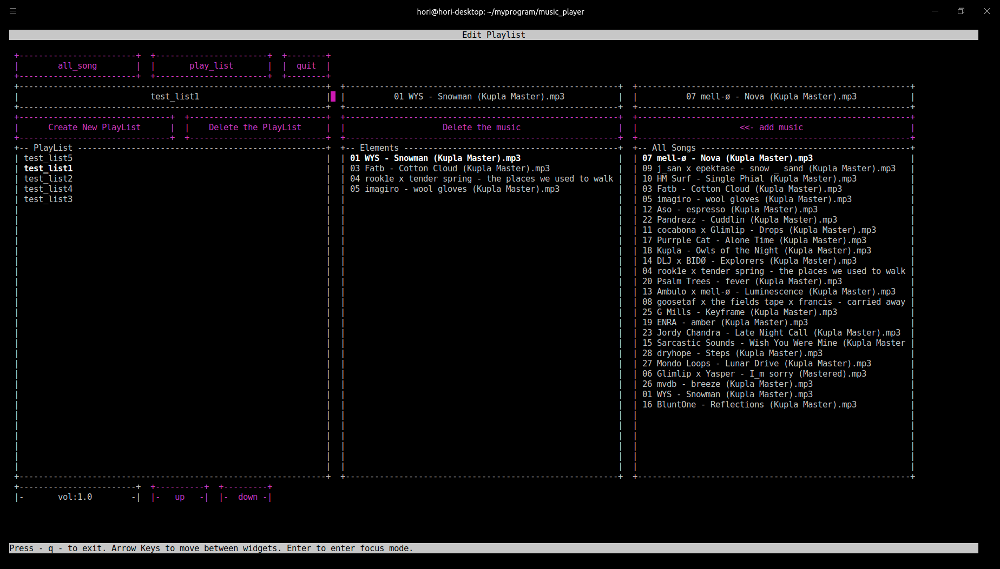

# PCMP : Python-console-music-player

## Abstract 
 It is a music player that can be used on the terminal written in python.
There are three functions.
1.Title playback 
2.Playlist playback
3.Playlist editing
 In this software, I used pygame to playback music and py_cui to draw 
CLI screens.

## Title playback
 
 You must include music files to play in "materials". 
 At the startup of this software, you see the title playback screen displayed 
by default. You can pick the title you want to play from the “All Songs” menu.
 And if you push the “Start” button, the selected music will start. If you 
press the “Stop” button, the music will stop. If you press the “<-skip” or 
the “skip ->”, the next or previous music will play.

## Playlist playback
 
 You can playback a created playlist.
 You can create playlists on the edit playlist screen. If you push 
“play_list”, the playlist screen will be displayed. 
 You can pick the playlist you want to play from the “PlayList” menu. And if 
you push the “Start” button, the selected playlist will be played. If you press
the “Stop” button, the playlist will stop. 

## Playlist editing
 
 You can create, edit and delete playlists.
 You can move to this screen by pushing the "edit_plyalist" button on the 
Playlist screen. 
 
 You can choose a playlist to edit from the “PlayList” menu on 
the left side. Elements of the selected playlist are displayed on the “Elements” 
menu in the middle. Push the "delete the music" button to delete the selected 
music from the playlist. If you pick a title from the “All Songs” menu on the 
right side and push the “add music” button, the selected music will be added to 
the playlist.

## Exection
<b>$python music_player.py</b>
You can use it with this command.

## Current situation 
 I have started this project to make a music that I can use intuitively on a terminal.
However, my motivation rapidly declined because I found that I can work more effectively
in silence with no sound.
 Now, my development is very slow. So, I decided to make this software public.

### Problems
* There is no script to set up this software
* This software can't sort music files
* This software loads files from only the specified directory ("materials")
* A progress bar doesn't work. It's just decorations.

I'll gradually solve these problems in the future ...

